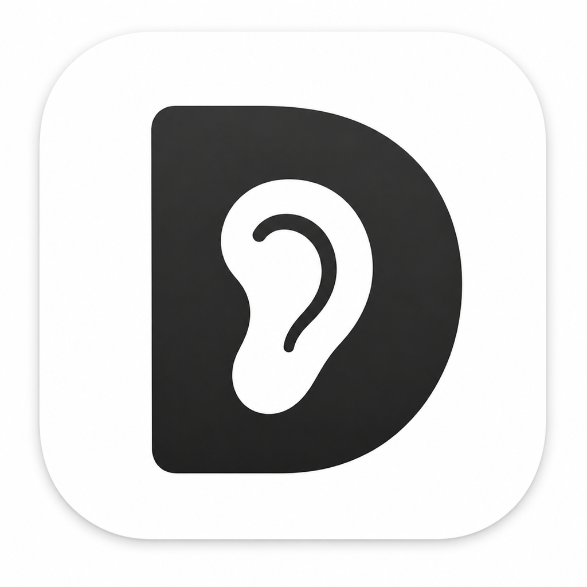

<p align="center">
  
</p>

<h1 align="center">Dob</h1>

<p align="center">
  <strong>An AI reading and writing tool for macOS</strong>
  <br />
  Let important information pass through your mind and stay on your Mac.
</p>

<p align="center">
  <a href="README.md">中文 README / Chinese Edition</a>
  ·
  <a href="https://github.com/Milktang0128/Dob/releases">Download</a>
</p>

---

**Dob** is a native macOS menu bar app built around selected text. Select a passage anywhere, then read it aloud, explain it, translate it, proofread it, compare model answers, or save it into a local archive.

Dob is not trying to replace a full chat app. It is a small reading and writing tool that stays next to the text you are already working with.

## Brand

Dob's Chinese positioning line is **过耳不忘的 AI 读写工具**. The idea is simple: important information should not merely be processed by AI; it should pass through your perception, understanding, and review loop, then stay available on your own computer.

The new app icon uses a black **D** shape with an ear-like inner cutout. It connects the product name with the act of listening, reading, and remembering.

| Edition | App name | Audience | Release channel |
|---|---|---|---|
| Chinese | Dob | Chinese reading and writing defaults | `v...` |
| International | Dob International | English interface and English-first defaults | `listenmark-v...` |

0.3.x is a bridge release: user-facing branding and installers move to Dob, while legacy bundle identifiers, defaults domains, and support folders are kept so existing users retain automatic updates, Accessibility permission, API keys, hotkeys, archives, and history.

## Download

Signed and notarized installers are published on GitHub Releases:

<https://github.com/Milktang0128/Dob/releases>

| Edition | Installer | Notes |
|---|---|---|
| Chinese | `Dob-...-arm64.dmg` | Recommended for Chinese users |
| International | `Dob-International-...-arm64.dmg` | English UI and English-first workflows |

Automatic updates follow the matching release channel. The Chinese and international editions do not cross-update.

## What Dob Does

| Situation | Dob workflow |
|---|---|
| You are reading unfamiliar text | Select it, then read, explain, translate, or summarize |
| You are editing a draft | Use Proofread to get the revised version directly |
| You want to compare model quality | Compare the same action across up to three models in one view |
| Direct text capture fails | Use screen OCR or the manual input panel |
| You only need OCR text | Use Silent OCR Copy to put recognized text on the clipboard |
| Something is worth keeping | Save it to the local Markdown and JSON archive |
| You need a temporary lookup trail | Silent History keeps the latest 500 lightweight records |
| Auto-pop is annoying in one app | Disable auto-pop for that app or globally from the panel |

## Core Features

### Selection Panel

Dob appears as a compact floating panel near selected text. Read stays first; other actions can be reordered, disabled, edited, assigned hotkeys, or moved into the More menu.

Keyboard controls:

| Shortcut | Action |
|---|---|
| `Esc` | Close |
| `⌘R` | Retry current action |
| `⌘C` | Copy result |
| `⌘S` | Save |
| `⌘P` | Pin window |
| `⌘1` to `⌘5` | Run the first five actions |
| `⌘+` / `⌘-` | Adjust result text size |

The copy icon copies immediately, then shows a small save affordance.

### Context-Aware AI

Explain, Translate, Summarize, Insight, Proofread, and custom prompt actions use full-text context by default when the current app exposes accessible surrounding text.

Dob does not archive the full context by default. Saved context is lightweight: about 200 characters before and after the selection, with the selected text highlighted as Markdown:

```md
Before context ==selected text== after context
```

When context is used, the result area shows a small "Context included" indicator. This can be disabled in Settings.

### Input and OCR Fallbacks

| Capability | Default hotkey | Use case |
|---|---|---|
| Input Panel | `Control + Shift + I` | Open the toolbar with a text box, then paste or type any content |
| Screen Selection OCR | `Control + Shift + O` | Select a screen region for OCR, then open the panel |
| Silent OCR Copy | `Control + Shift + C` | Select a region and copy recognized text without showing the panel |

OCR uses Apple Vision locally and does not require an API key. Dob can also run your most recent action automatically after OCR, which is useful for repeated OCR translation or explanation.

### Actions

Built-in actions:

| Action | Default | Description |
|---|---|---|
| Read | On | Speak selected text directly |
| Explain | On | Explain the core meaning, default `Control + Shift + E` |
| Translate | On | Translate foreign text to English, or rewrite English more clearly, default `Control + Shift + T` |
| Summarize | On | Give the core takeaway |
| Context | Off | Add the background needed to understand the selection |
| Insight | Off | Surface deeper meaning, values, tension, or implications |
| Blind Spots | Off | Find missing assumptions and weak points |
| Proofread | Off | Output the proofread revision directly |
| Mnemonic | Off | Create a memorable recall cue |
| Close Read | Off | Analyze sentence structure and key phrases |

You can add up to four custom prompt actions. Each action can have its own icon, prompt, enabled state, order, and global hotkey. The editor includes AI Optimize for improving prompts with the current model.

AI actions can auto-read their final result. You can turn that off so AI results are displayed only; the Read action is unaffected.

### Model Compare

Dob can compare the same action across the default model and up to two alternate OpenAI-compatible providers. Results appear in one comparison view. The default model reuses the existing result instead of regenerating it.

### Services

Services are managed in one window:

| Category | Supported providers |
|---|---|
| Text | DeepSeek, OpenAI, custom OpenAI-compatible endpoints, Kimi, Qwen / Bailian, Zhipu GLM, Volcengine Ark, SiliconFlow, Google Gemini, OpenRouter, and more |
| OCR | Apple Vision local OCR |
| Speech | macOS Speech, Volcengine TTS, Microsoft Speech, Google Text-to-Speech, Tencent Cloud TTS |

Text and speech services include test buttons. When cloud speech is preparing audio, Dob shows a status indicator; if a cloud TTS provider fails, Dob falls back to local macOS speech.

### Archive, History, and Review

Dob separates deliberate Archive from Silent History:

| Record type | Purpose | Stored data |
|---|---|---|
| Archive | Long-term review | Source text, result, app, time, action, and lightweight context excerpt |
| Silent History | Temporary lookup | Latest 500 source/result/action/source records, without full-text context |

You can choose a custom Markdown archive folder, including an Obsidian vault. In the 0.3.x bridge release, the international edition keeps the legacy support folder:

```text
~/Library/Application Support/ListenMark International/
```

The readable Markdown archive is:

```text
Dob International.md
```

## Quick Start

1. Open Dob International and grant Accessibility permission when macOS asks.
2. Open Services from the menu bar item.
3. Add an OpenAI-compatible API key for AI actions. DeepSeek is prefilled as the recommended default provider.
4. Select text in any app, wait for the panel, or press `Option + Command + R`.

Without an API key, Read, OCR, copy, archive, history, and local review still work. AI actions require an OpenAI-compatible Chat Completions API.

## Default Hotkeys

| Action | Hotkey |
|---|---|
| Show panel | `Option + Command + R` |
| Read | `Control + Shift + R` |
| Explain | `Control + Shift + E` |
| Translate | `Control + Shift + T` |
| Input Panel | `Control + Shift + I` |
| Screen OCR | `Control + Shift + O` |
| Silent OCR Copy | `Control + Shift + C` |
| Open Settings | `Command + ,` |

Every action can have its own global hotkey.

## Build

Build the international edition:

```bash
FLAVOR=en ./make-app.sh
open "Dob International.app"
```

Build the Chinese edition:

```bash
./make-app.sh
open Dob.app
```

Run during development:

```bash
swift run
```

Package and notarize:

```bash
./package-release.sh
```

## Notes

- Direct capture depends on macOS Accessibility and, when needed, a simulated copy fallback. Some apps may block both.
- Full-text context is best effort. When unavailable, Dob falls back to selected text.
- Browser source URLs are stored in a readable form by default, with query and hash removed to avoid saving tracking or private parameters.
- AI actions require an OpenAI-compatible Chat Completions API. Provider-specific model names, rate limits, and context windows depend on the provider.
- Cloud speech services require provider-side setup and credentials. If a configured cloud provider fails, Dob falls back to local macOS speech.
